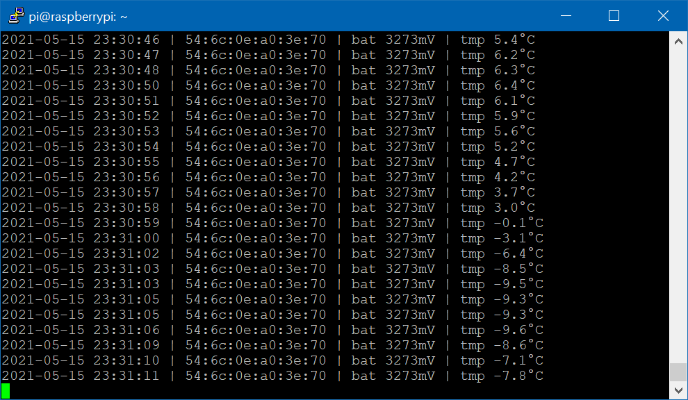
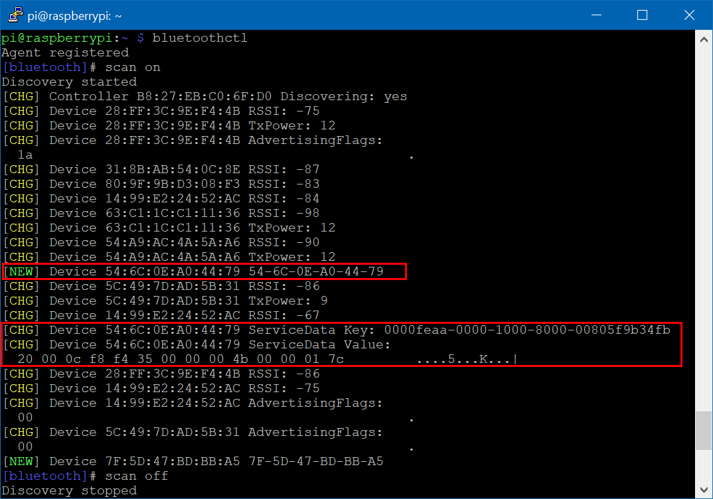

# Raspberry-Pi BLE scan Eddystone TLM

Scan BLE broadcasting of Eddystone TLM-type beacon.  
I had Raspberry Pi 3 and wanted to monitored several temerature sensor by BLE. 

 

## Install

### 0) Raspberry Pi
- Install on host-PC [Raspberry Pi Imager](https://www.raspberrypi.org/software/) and write "Raspberry Pi OS" to microSD card
- Put to microSD card 2 files: `ssh` and `wpa_supplicant.conf`. It will make it possible to connect Raspberry via WiFi. Install microSD to Raspberry
- I am using [Putty](https://www.putty.org/) as ssh-client and [WinSCP](https://winscp.net/eng/download.php) for file transfer over ssh

### 1) Check BLE

Check BLE subsystem by Linux Bluetooth subsystem:

```console
bluetoothctl
scan on   (in the Bluetooth command-line tool)
```

Type for exit from *bluetoothctl*

```console
scan off
exit
```

Result will be similar:
 

### 2) Install Python3 and Bluepy

Install `libglib2.0-dev` package, press 'y' during installation
```console  
sudo apt-get install python3-pip libglib2.0-dev
```
Install [bluepy](https://github.com/IanHarvey/bluepy) - Python interface to Bluetooth LE
```console
sudo pip3 install bluepy
```

Add permissions for bluepy-helper module
(https://github.com/IanHarvey/bluepy/issues/313)

```console
sudo setcap cap_net_raw+e  <PATH>/bluepy-helper
sudo setcap cap_net_admin+eip  <PATH>/bluepy-helper
```

Where <PATH> is the place where `bluepy-helper` is installed; use `find` to search 
```console
find /usr/local/lib -name bluepy-helper
```
 
### 3) Run program

Copy program using WinSCP and run
```console
python3 scanEddyTLM.py
```

The program will save in "tlm.csv" the last received record of each beacon once a hour

### 4) Add program to startup

(https://www.dexterindustries.com/howto/run-a-program-on-your-raspberry-pi-at-startup/)

Put command of run program at the bottom of `.bashrc` - program starts after user log-in
```console
sudo nano /home/pi/.bashrc
```

## TODO

- make listening cycle without restart bluetooth agent every second
- send result to web-host for visualisation, e.g. TagoIO